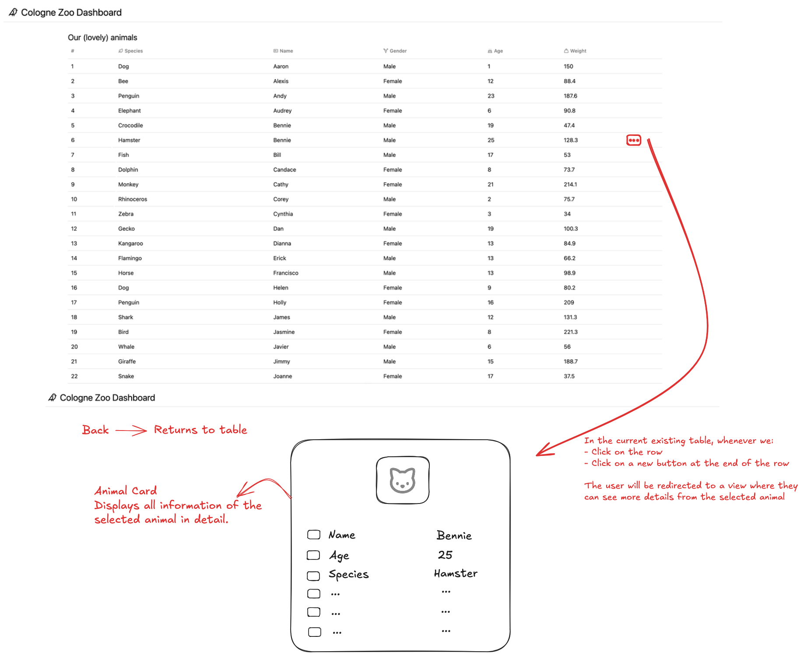
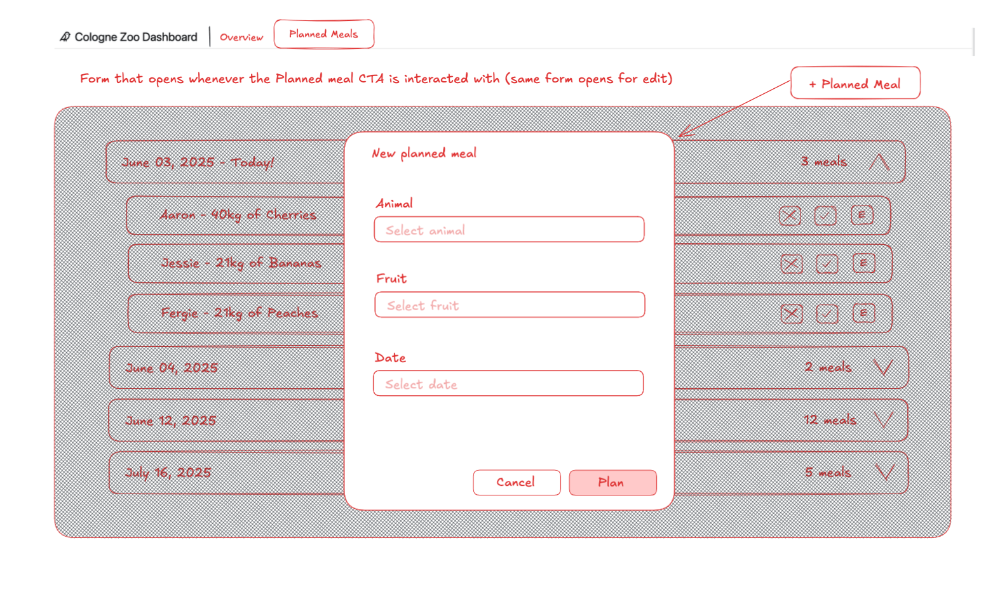

# Challenge

Welcome to the challenge!

Some packages are already being installed for you below - you can just start reading the below text while that finishes.

## The Introduction

The following script takes you through tasks you should complete as part of your challenge. Some tasks may be tricky, some may be easy. In every case you are encouraged to pose written questions to the task itself, write down questions/observations or reasoning about why you did not find a solution. In most cases though, a working solution will be achievable. In all cases it will be helpful if add notes about your methodology (e.g.: "I did X using Y because of Z, then A happened which I fixed doing B. I should have seen A coming but didn't because of C").

There will be no loop with the reviewer, so nobody is going to answer your notes, questions, musings, ... - their main aim is to showcase your thought process for a fellow developer who will inspect this challenge. For the texts you can write everything from a bullet list to a book, but be aware that in development we usually try to optimize for a combination of dense information + understandability by every team member. We firmly believe that good communication and conceptualization is as important to being a developer as the coding itself.

// Pato: Hi there, I'm Patrick (but everyone calls me Pato). I find the paragraph below super on point, thanks for adding it!

The challenge tries to be similar to the real-world with the kinds of problems and solutions that would occur in every-day-project-work. There will be no questions asking you to optimize runtime-complexity in O-notation to the max for algorithm Y - these sort of questions do not make any sense in our opinion. Being close to the real-world also means that you may bring in CSS/JS Libraries to help you develop, just make sure that everything still runs in stackblitz.

The tool we use here is called `stackblitz`. It functions as a fully integrated development environment (IDE). You can go through the full challenge here. If you want to use your local environment you can also download the project using the small "cloud icon" at the top left corner of the screen, just right of "Project". _In the end, the challenge code must run in here inside `stackblitz`, so `pnpm run dev` has to work. If this is not the case, we will not be able to review your challenge!_

## Tech-Stack

You can skip this section and revisit it later, as the right information will be shared with you at the right places and everything should "just work" as we inteded it to work. If you still want to learn more right now, read on!

This is a "fullstack" TypeScript project using nuxt3 + vue3. Fullstack TypeScript means that we use one typescript code base for both the backend API + the frontend webapp. We have defined helper commands for development, testing, running the app in production, linting, ... that are runnable via `pnpm run X` where X is the command, checkout the `package.json` for more.

For styling we use TailwindCSS, so far the zoo has not added a CSS component framework to use pre-made components, maybe you will? For testing we use `vitest`, for linting `eslint`.

This information will also be shared with you where needed as part of the challenge, so there is no need to dive into anything at all for now.

## The Challenge

So, without further ado: Welcome, new IT Director of the Cologne Zoo! As you can see, the zoo dashboard was badly damaged by the recent malware attacks from the Duisburg Zoo. The old IT Director quit after that attack as he just could not take it anymore. The staff is looking to you to fix this mess and bring the zoo dashboard back to its former glory! 🐻 🐵 Sadly the IT-Department has been underfunded for years before the attack - so the application is quite dated.

### Task 1: Take stock of the repository

In a first step you should inspect the health of the project and report on everything you notice while doing so. This will help you determine what repairs are necessary in the coming steps.

Please take stock fo the page using developer tools, your instincts, ... and write down below what you find.

// Your solution

Hellow again! Thank you for taking the time to read my annotations and ramblings as the new IT Director of the Cologne Zoo :)

Alright, the first thing I noticed is that we have an error `alert is not defined` that's appearing whenever the `pnpm run dev` command is executed. I will leave it as it is for now, as I will take a look into how the project is structured, peek into the `package.json` file to know which dependecies are available from the start, and observe the configuration of the tools that the previous IT Director has used.

After taking a look into the the structure, I found that the main issue that the main issue from preventing the our dashboard to start is found in `app.vue` where there's a function invoked called `alert()` which isn't declared. Not only that I have identified some other issues that should be addressed:

- General structure of the dashboard could be improved by following a better structure, for example creating a folder called `types` which would hold our types in the root app or a `tests` folder that holds all our tests. This would help us to better organize our code and make it easier to maintain and extend in the future.
- Outdated dependencies, there are some deprecated dependencies such as ESLint which has a new major release (v9+) and Nuxt as well, which utilizes the newest versions of Vue and allows us to use features like reactive props destructure, defineModel, etc. Having up to date dependencies allow us to utilize the newest features and improvements
- Took a look into the configuration files of what the previous director used and I'm happy that even he was under duress from the Duisburg zoo he managed to write some config files like `eslint.config.js` or `.editorconfig` which allows us all employees to configure our editor and IDE to follow the same rules and conventions!

Before tackling this issues above, we will move forward with the task number 2. As getting our app up and running is more important than fixing the structure and dependencies which doesn't directly affect our staff :)

### Task 2: Get the basics running again

Now that we know that is broken, let's try to get things running again, step by step. First we should aim to just get the project to start. Please fix the problem that stops `pnpm run dev` from working out. Then:

- document the loaded page with a brief description,
- document the problems that needed to be resolved to make it work (so that we can avoid and quicker fix them in the future!)

Zookeepers reported that the error sometimes changes when reloading the page after the initial start.

// Your solution

Alrighty, to fix the first functionality issue, we need to remove the `alert()` function in our `App.vue` file. It seems somebody from the Duisburg Zoo managed to add an alert function that was causing the error. We will definitely remove it and show them that we are not easily defeated!

Onwards with the documentation:

Loaded page: On a first glance, there's a a brief introduction of what our application purpose is, a warning about the continous attacks of Duisburg and a table that should be populated with the animals from our zoo but it appears to be empty.

Problems that need to be resolved to address the issues:

- Having the terminal open we can see that we have a specific typo error on the `server/api/animals.get/ts` file declaring that `ANlMALS is not declared`. Let us fix that error by addressing the typo and utilizing the correct constant.
- The error which was also been propagated to the developer tools in the browser was preventing our `GET` endpoint to actually work correctly. Now that we have correctly addressed the issues we have our simple table up and running!

### Task 3: Start the documentation

You got it to work! Nice, now the basic functionality is back for the zookeepers. This would be a great point to start on documenting the project. As you can see there is not even a readme file! The old IT Director seems to have left this project in bad shape. Please add documentation with basics on the project, how to start, stop, test, ... it and whatever else information you deem important.

Add your solution below, either as an inline text or link to new documentation file(s) you've created.

// Your solution

Alright, now that we had our app up and running so that our staff can use it, we took the time to write the documentation in our [README](README.md) file, which states:

- Tech stack we are utilizing
- The requirements and dependencies we are utilizing
- How to run our application
- How to test our application

We have also took the opportunity to:

- Update dependencies to the latest versions
- Add `simple-git-hooks` with `lint-staged` for code formatting and linting whenever we are commiting
- Restructure the codebase for better maintainability
- Create a CHANGELOG using [changelogen](https://github.com/unjs/changelogen) from the UnJS ecosystem, so we know which features we have added or removed

### Task 4: Test fixing

There's a failing test that for the age calculation helper. Can you figure out what is broken in the implementation or the test it is and resolve the problem? All zookeepers are really interested in what is going on here.

// Your solution

Back at it again! To solve this issue first I renamed `useCalculateAgeInYears` to `calculateAgeInYears`, since we are not returning a reactive value from the utility. This will help us differentiate between composables (which actually return reactive values) and utils (which do not return reactive values).

Then I implemented the `@nuxt-test/test-utils` module and `vitest.config.ts` with the `nuxt` environment to be able to test the necessary util.

After running the test suite we found out that our second test was failing, because it was expecting the calculation of age to be rounded up.

After that I went to check out the problem with the running test. We got a problem because initially we where utilizing `Math.round()` and given that `differenceInMilliseconds` was giving us `0` as a result, because dividing by `0` is always `0`.
actual age of the animal.
After researching on MDN, my first solution was to try to fix by only using [`Math.ceil`](https://developer.mozilla.org/en-US/docs/Web/JavaScript/Reference/Global_Objects/Math/ceil) but of course that didn't work because if we round `0` to well... `0` it will always return `0`.

I kept looking a little bit and found out about the [`Math.max()`](https://developer.mozilla.org/en-US/docs/Web/JavaScript/Reference/Global_Objects/Math/max) function which will return the maximum value between two numbers. So, in this case if we run `Math.max(0, 1)` where `0` is our `ageInYears`, we will always get `1` or the greater age of the animal.

Alright, test are passing! Take that Duisburg Zoo!

Now that our function is tested and working, I have added some TSDoc comments to help future team members understand the code better :)

### Task 5: UI Fixing and Improvement

The zookeepers report that the table is incomplete and different than usually. More specifically:

- they are missing the `Name` column that used to be in _third_ place,
- the table is sorted by weight, it used to be sorted by name,
- the age of the animals should show the age in years and not the birthdate
    - a composable for this already exists, made by the previous zookeeper

Please fix the two above problems and outline what was necessarry to do so.

// Your solution

Alrighty, first things I notice is that indeed the column and rows from the `TheAnimalTable` has been deleted, that our computed property is actually named correctly (`animalsSortedByName`) but inside the logic is sorting them by their weight.

This can only mean one thing, somebody has meddled with our code! 

Regarding the last point, we can definetly utilize our modified `calculateAgeInYears` but we will need to pass a proper `Date` object so the function actually works! Let's get on with it.

Now that our app is up and running and our staff can use it, we will proceed with the refactor of the component, UI and improving our code:

- First we will check the code that we wrote for our `animalsSortedByName` function could be made simpler.
- Secondly, we will try to remove the age calculations that appear on the table from the `<template>` so we can handle all of our logic in our `<script>` (I always try to do do it like this and only do things in the template if it's super necessary)
- Third, we will integrate [TanStack Table](https://tanstack.com/table/latest) to our TechStack so we can work easily with tables improving the DX and UX!
- Fourth, our app is designless as of now and we have to show the Duisburg Zoo that we also can do nice things! Given that currently I'm a one man team, I will implement a UI library [ShadcnVue](https://www.shadcn-vue.com/) which will allow to centralize the styling and components of our app.

Note: Depending on the project, on a more earlier stage I would already have discussed with the designer the UI/UX design, including:

- User flow and navigation
- Design System
- Typography and layout
- Responsive design and mobile optimization

Additional note on first and second point, I noticed we are using the `index` as a key for our v-for, and that's bad practice, we should always aim to use a proper `id` so we can maintain the state of the component.
We will address that by expanding our fake data file and updating all necessary types to achieve this

Note on the third point, now we have integrated TanStack Table into our component and app. This will allow us to handle pagination, sorting, filtering, and other features out of the box. Now we can easily add new features in the future with all the TanStack Table capabilities.

While implementing it, I encountered a new scenario, which was really interesting, basically we are asking TanStack table to handle sorting the table by the `name` column. This was actually breaking the original implementation of the first column `#`, which was `cell({row}) => row.index + 1`, this was giving us an incorrect ordering result like `#1, #27, #49, ...`. This was happening because the sorting is applied after the data is recieved and the index is not updated accordingly. So then we had to implement a specific function with TanStack capabilities:

```ts
cell: ({ row, table }) => ((table.getSortedRowModel()?.flatRows?.findIndex(flatRow => flatRow.id === row.id) || 0) + 1)
```

If we break it down it works like this:

1. `({ row, table }) =>**` - Destructures the cell context to get the current row and table instance

2. **`table.getSortedRowModel()`** - Gets the sorted row model from the table (since the table will be sorted by the `name` column)

3. **`?.flatRows`** - Uses optional chaining to safely access the `flatRows` array, which contains all sorted rows in a flat structure

4. **`?.findIndex(flatRow => flatRow.id === row.id)`** - Finds the index position of the current row within the sorted rows by matching row IDs

5. **`|| 0`** - Fallback to 0 if `findIndex` returns -1 (not found) or if any of the optional chaining returns undefined

6. **`+ 1`** - Adds 1 to convert from 0-based array index to 1-based display number (so the first row shows "1" instead of "0")

So if you sort by name and "Zebra" becomes the first row, it will show "1" in the index column, even though it might have been row 50 in the original unsorted data.

For the fourth point, we installed `shadcn-nuxt` as a module which on it's latest version utilizes [RekaUI](https://reka-ui.com/) (old RadixVue) and TailwindCSS v4. Given that the `@nuxtjs/tailwindcss` was giving issues and we would have to install [tailwind nevertheless as a separated dependency](https://tailwindcss.nuxtjs.org/tailwindcss/configuration#tailwind-css-version) to actually utilize Tailwind v4, we decided to use the `@tailwindcss/vite` package directly. Which allows us to use Tailwind v4 without any issues for the ShadcnVue package.
Hopefully they fix this, I see that they already allow [initial support for Tailwind v4 with the latest version](https://github.com/nuxt-modules/tailwindcss/pull/980) of `@nuxtjs/tailwindcss` but it's still giving errors for the Shadcn package.

### Task 6: UI Feature 1

The zookeepers want to be able to see all details of an animal. Please create such a view that allows them to do so, outline anything about your process while adding the view below. The zookeepers didn't have time for more information, sorry. They'll surely be glad to criticize the first version intensly though and will want to know why you went for the approach you chose.

// Your solution

Alrighty, to continue with this solution, I will quickly design how the flow should look like to get to that view and also what kind of details will be displayed using excalidraw.

I'm a visual person and whenever I'm asked to design something I rather have something tangible which I can show to the client and get feedback on. So I'll start by creating a wireframe!

After a quick sketch, here's our wireframe: 

Now, let's start implementing our views by creating a `/pages` folder and then the new view with its respective dynamic routing. Since we already implemented an `uuid` for the `id` property of the animal, we will use that as the route parameter.

Now we have a new folder `pages` with a new structure `animals/[id].vue`. This will allow us to always get the animal by its `id` and display its details. We have also modified `app.vue` to utilize `<NuxtPage>` to render our views and we decided against using `<NuxtLayout>` since for now we only have one where the header is displayed

Next, we will handle the redirection from the table logic so we can have the flow up and running.

Now  that the basic flow is implemented, I will now proceed with creating the api that will allow us to get a specific animal. I already see that we will need to restructure our `animals.get.ts`,because we are creating the `ANIMALS` array in that file.

Since we don't have a real DB in this case, I will utilize `fakeData.ts` as our source of truth, so we export `ANIMALS` from there so we can utilize the same data for both of our endpoints (and let's not forget about Aaron!)

After we unified our "DB" now I modified the structure of our server folder so we can have `server/api/animals/index.get.ts` and `server/api/animals/[id].get.ts`. This will allow us to group our API endpoints under a same group. On the `[id]` route I added some errors to handle the flow mock request

Now the next thing will be to modify the composable `useAnimals` to handle the new API endpoint. Because before we returning `animals` and `fetch` and executing `fetch` on mount, now we need to modify the structure of it: we make a new ref `animal` and along with `animals` we make them singletons. Then inside of the function we return `fetchAnimal` and `fetchAnimals` which allows us to fetch a single animal or all animals. Given that we removed the original `onMounted` lifecycle hook, we will execute it in the the components were we are going to display that data!

Now that we have all the data available, I will start displaying the data in the proper animal view. This one will utilize the card component from Shadcn to make it look nicer. Here I wanted to allow flexibility when displaying the properties of the animal, but of course some things aren't needed to display such as `name` and `id`, because `name` is used already on the title and `id` is more by use IT's than the actual staff of the Zoo.
Given this case I have created a computed property which filters our name and id, and allows me to diplay the properties I choose so inside of the card. After implementing some styling and adding some structure with semantic HTML I found out that I was having the same problem as in `TheAnimalTable` where we where executing `calculateAgeInYears` in the template. So I had to add an extra step on the return, where we say that `birthdate: calculateAgeInYears(new Date(rest.birthdate))`. Looking at this there are already two places where we are actually implementing this "functionality". At this rate I think it would be better to actually create a calculated `age` property that comes directly from the backend. This could be a nice refactor for the future.

After rendering everything in the card, I noticed that I was rendering everything straight what we got from the object, and that was causing some formatting issues, for example we were rendering `favouriteFruit` instead of `'Favorite Fruit'` size-20and we weren't adding the measurements to specific properties like `weight` and `height`. I decided to create a `constant.ts` file where we address all labels and units that we would like to display in our frontend. By creating three constants `ANIMAL_KEYS_LABELS`, `ANIMAL_MEASUREMENTS`, and `ANIMAL_KEYS_ICON` we can assure consistency across all of the app to what we display for them. One thing that I dont really like is the complicated generic type for the `ANIMAL_MEASUREMENTS`

```ts
  [K in keyof Animal]: K extends 'height' | 'weight' | 'birthdate' ? string : null
```

I know I could actually write `Record<keyof Animal, string | null>` but in this case I actually know which properties do have a value and which not.

Now that we have this constant in places, I can also integrate them into the `TheAnimalTable` component, so we can have both views displaying the same measurements, labels and icons :)
(It's funny that now can have a frog or a fish that weighs 222kg haha)

Small note for this task: I notice that whenever you access a different animal card, the previous values of the animal are briefly displayed, this is happening because the the ref is still holding the old value until the `onMounted` fake `fetch` finishes executing. On a real project, this would be replaced with a `Skeleton` component or a spinning `Loading` component whenever the value is loading/fetching.

Funny error, whenever I was trying to commit this part, eslint was trying to lint fix line 208 and it was giving me a cryptic error about a missing comma. Apparently it was trying to make sense of the generic typing! I have disabled it in the `eslint.config.js` now

### Task 7: Logic Feature

The zookeepers want a new feature: Calculate the food required for the next calendar month. Basically, the zookeepers want to ease their job and buy a month worth of food in advance. In order to do so they want you to calculate and display the food all animals need for the next month.

To calculate the food an animal needs in kilograms in 1 day, the zookeepers use the following formula:

1. Take height + weight and divide it by 250
2. If the animal is:
    - older than 20 years, half the required food,
    - younger than 2 years, double the required food
3. Cherrys have less calories, so if the favourite fruit of the animal are cherries, add 28 kg
4. If the animal is male, add 20 %
5. If the animal is a fish: The required food is 0 kg

// Your solution

Oh wow, this one will be need a convoluted if case to solve.

At a first glance, I think we do not need to modify our original `Animal` type and our DB, and instead we can create an util which we pass our `animal` to it so we can calculate it.
Let's start by doing that, we will call it `calculateFoodInMonth`, and also since the formula that the staff provided is calculated in `days` we will need to multiply it for 30 (for a median)
- Following the instructions:
1) The first point is not so clear, do they mean that the calculation of animal size divided 250 is the food? As we do not have an accurate specification we will assume it is, we will call it `requiredFood`
2) Secondly we have a conditional that depends on the age of the animal, there are only two cases that might affect the `requiredFood` so we will lave it as it is (here we are also repeating what I said in line 203, we should have definetly added `age` as a property that is calculated in backend)
3) Third case, if the animal has `cherry` as favourite fruit, we add 28 kgs to `requiredFood`
4) Fourth case, we add 20% if the animal is male
5) The animal is a fish, we set the food to 0kg (poor fish!)

Nice, now we try to integrate it into the main table to see how it looks and we can clearly see that we are having some results. Let's round our result so we can have a more precise number, we will use `Math.ceil()` for that.

Now we have a new property that doesn't enter into our `Animal` interface, but we would definetely add that in the database so we can handle all these types of calculations over there if this would have been production. Let's update our constants nevertheless so we can have all the labels and icons necessary

Let's add the property also into our lovely card (Animal View).

Since we are passing a ref into our util, I will also modify the util to accept `MaybeRefORGetter<Animal>` and then uwrap it with `toValue` so we can safely access it.

Alright, feature implemented. I really don't like the way it's implemented as of now, because like I said, these should be implemented directly into the `Animal` interface, so we can handle it from there. This would be a calculation we do in our backend but since it's a feature our staff needs to work efficently, we implement it as it is and on the next iteration we refactor it! I like to follow this [Addy Osmani post: First do it, then do it right, then do it better.](https://addyo.substack.com/p/first-do-it-then-do-it-right-then) as a guideline. We could have spent hours and hours overengineering this feature but it's more valuable to ship something that it's tangible and then move forwards from it.

### Task 8: Plan New Feature

After the disastrous specification of the new UI feature in the previous task, the zooplanners now want to sit down with you to plan the next feature better before implementation begins. Together you come up with requirements that you write down from the user-perspective (the zookeepers):

- I want to plan when to feed which animal,
- Per animal I want to be able to plan a day + a fruit that I feed them
- There should be an overview of all upcoming feeding tasks that tells me:
    - the animal name,
    - the food fruit,
    - the required amount of food
- the required amount of food is calculated using the algorithm from the previous task
- Tasks should be grouped by day, so that I have something like a "todo" list for each day
    - so for exmaple a structure like:
        - 24.03.2012
            - Anni, Bananas, 20kg
            - Belfried, Cherries, 10kg
        - 27.03.2012
            - ...
        - ...

Please create a breakdown for this feature. You can focus on aspects like: What tasks do we need to cover, what should their order be, how will the UI/UX be designed, what questions arise from the potentially inconsistent or incomplete staff requirements?

Don't spend more thatn 15-30 minutes here - planning like this can quickly become quite complex and we want to prevent this challenge taking too much of your time!

// Your solution

This is clearly an improvement from the previous task guideline! Let's go Cologne Zoo!

Alright, to start planning this I will note down some scribbles on things that need to happen to accomplish this:

- We will need to firstly create a new table in our DB to hold the planned meal, the table will need to have 4 columns:
    - `animal_id`: Which matches one of our own lovely animals
    - `selected_fruit`: Matches the favourite fruit of said animalId unless it's selected otherwise
    - `required_food`: Amount of food required to feed the animal
    - `planned_date`: Date when the meal will be planned for
- We will need a few endpoints:
    - A CRUD of endpoints for planned meals
    - One to fetch all planned meals (with pagination) which return all the planned meals in a grouped format:

    For example:

    ```json
    [
      {
        "date": "2025-05-03",
        "id": "1212312cd-1234567890-123hjasda-1234567890",
        "meals": [
          {
            "animal": {
                "id": "4136cd0b-d90b-4af7-b485-5d1ded8db252",
                ...,
            },
            "selected_fruit": "cherries",
            "required_food": 10
          }
        ]
      }
    ]
    ```
- New view where we will have a custom collapsible component of tasks and a button that allow you to add more planned meals
    - Whenever we click on the button, a modal form will appear with 3 form fields
        - Animal Field (Select): Allows you to select a specific animal
        - Fruit Field (Select): Allows you to select a specific fruit from all the fruits that we have in the DB
        - Food Field: Will be automatically calculated based on the selection of animal and fruit
    - For the collapsibles, the title will be the date of the planned meal, how many there are.
        - Inside of them, there will be items that display the animal, fruit, and food required and at the end of the collapsible, three buttons that allow you to mark as done, delete or edit the task.
- Like we did with the previous feature, I will do a rough wireframe sketch to visualize how it would look like.

Before even doing the sketch, already some questions arise, for example:
- How do we differentiate between animals in the select field? There might be many with the same name, species, etc
- Whenever the creation is implemented, to best improve UX, how do we handle long list of tasks? Infinite scrolling or pagination?
- Would we also like to display the next planned view in the specific animal view?
- We should also disable the selection of any animal that's a Fish, because since they have 0 food to eat, they don't need to be fed.

While designed I realized we could also integrate another endpoint to actually fetch the meals whenever the collapsible opens. I think in this way we could reduce the size of requests to the server and improve the performance of the overall view

Here are the quick sketches

First for the planned meal view:


Secondly, for the form:


Like the guideline says, the task could become quite complex, so it's better to have a small MVP up and running and iterate from there until we get the best results :)

### Task 9: Finish the documentation

Revisit docs from step 3, see if you want to add anything. Also think about bonuses. Add a general comment about anything (inside the universe of the challenge or out of it) if you want to.

// Your solution
